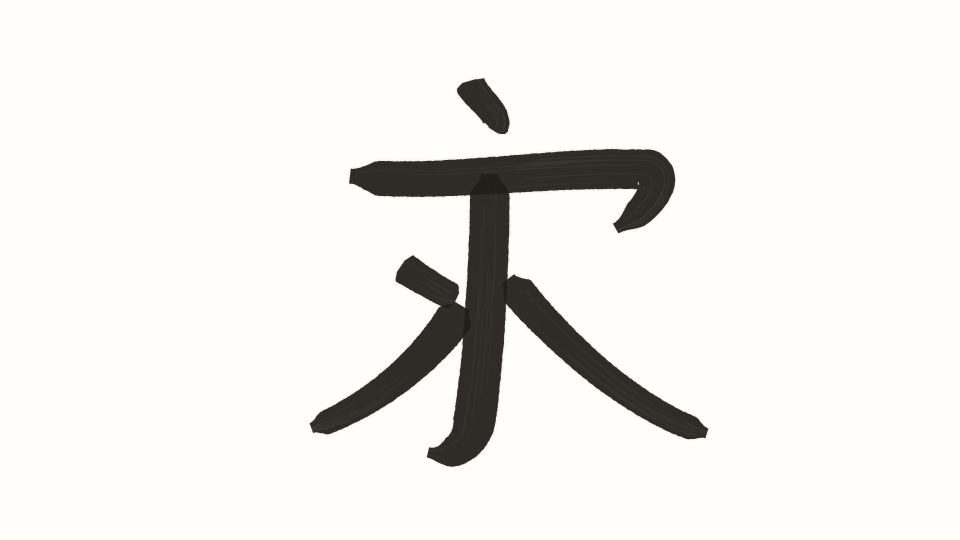
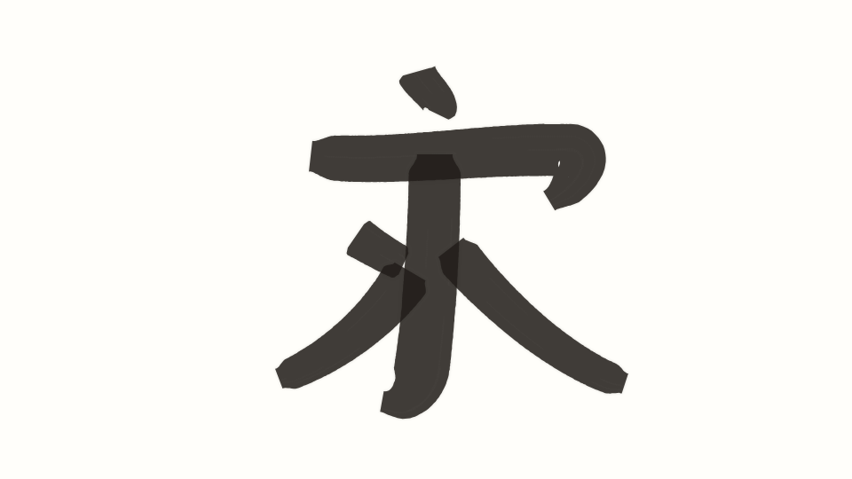
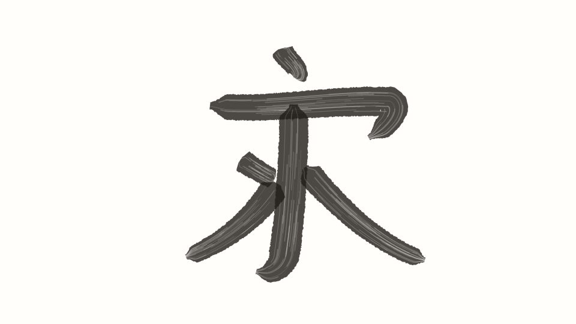

# HTML5 Chinese Calligraphy · 毛笔书写实验

在浏览器中体验毛笔笔迹。仓库保留原有 `index.html` 原型，同时提供无需构建、可离线打开的独立版 [`standalone.html`](standalone.html)。

## 效果预览

以下图片使用独立版的笔刷渲染器，以**同一组模拟数位笔轨迹**绘制，便于对比不同预设；它们是实际笔迹输出，不是界面设计稿。

| 均衡狼毫 | 柔软羊毫 | 枯笔飞白 |
| :---: | :---: | :---: |
|  |  |  |

## 使用

直接用现代浏览器打开 `standalone.html`，在纸张区域按住鼠标、触屏或数位笔书写。页面不需要服务器、npm 或网络资源。

- **预设**：均衡狼毫、柔软羊毫、枯笔飞白、硬毫勾线，也可以自定义。
- **基础参数**：笔锋粗细、墨色浓淡、笔锋干湿、墨色。
- **进阶参数**：速度响应、起收锋、运笔平滑、丝纹强度；另可选择纸张底色。
- **操作**：撤销、重做、清空和导出 PNG；设置仅影响之后的新笔画。

`index.html` 是原有页面，仍使用 `js/` 与 `strokes/` 中的资源；独立版的笔刷、样式和交互均包含在单个 HTML 文件中。

## 致谢

原项目由 [Ming Wong](http://chakming.com) 创作，原 README 标注 MIT 许可。独立版是在该原型基础上的实验性实现。
