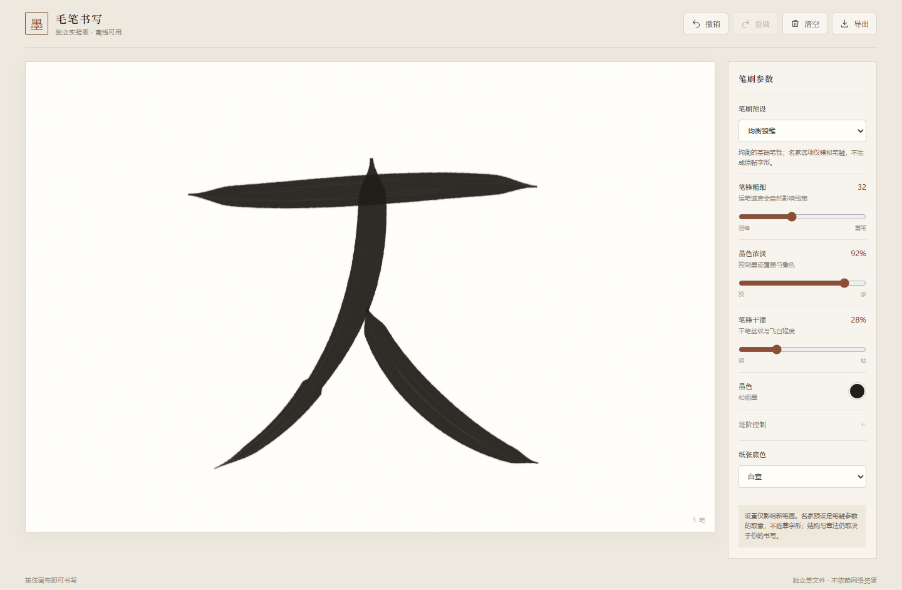
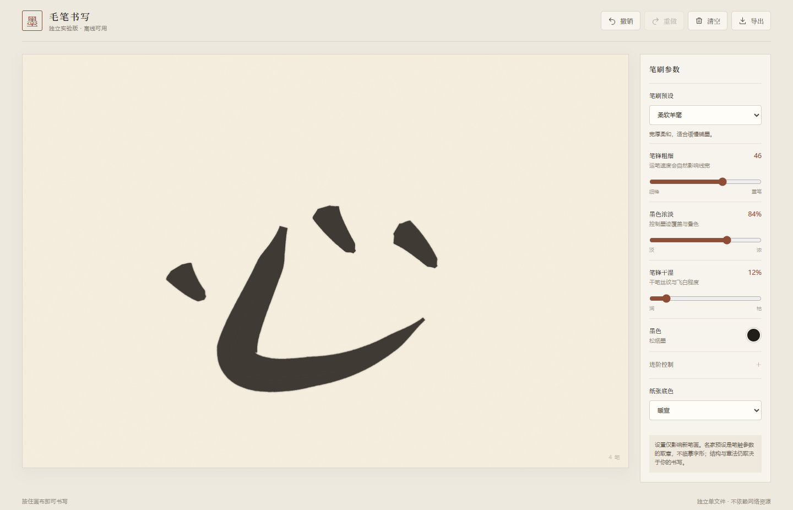
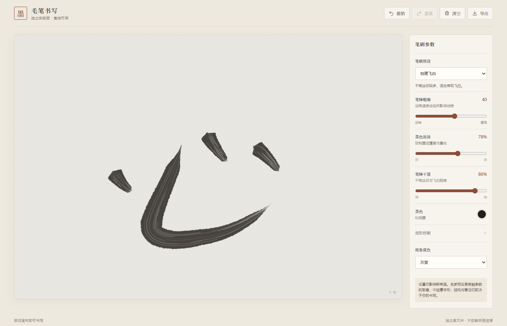
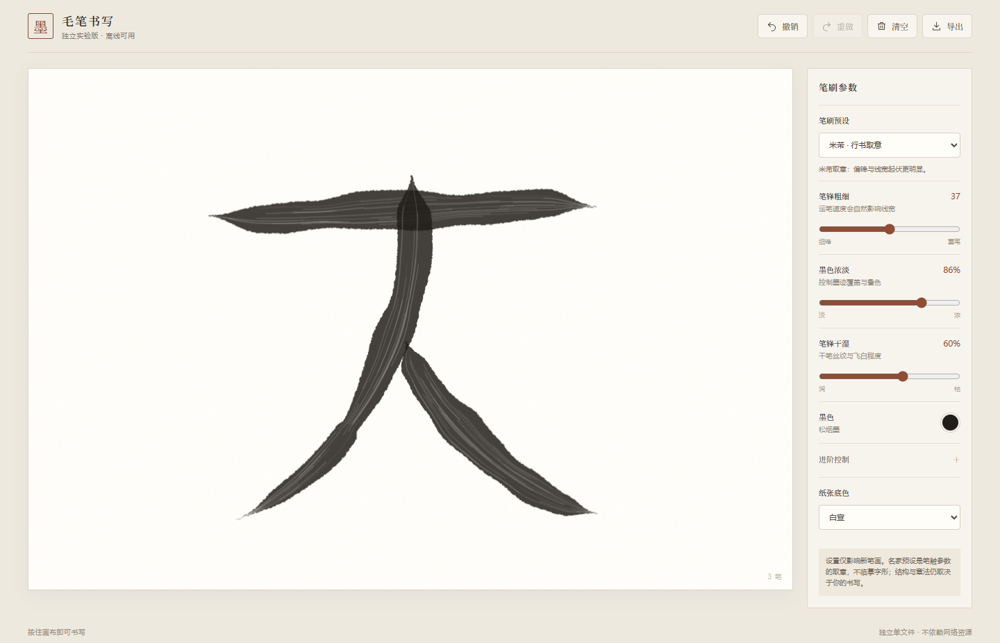

# HTML5 Chinese Calligraphy · 毛笔书写实验

在浏览器中体验毛笔笔迹。仓库保留原有 `index.html` 原型，同时提供无需构建、可离线打开的独立版 [`standalone.html`](standalone.html)。

## 独立版页面截图

下面是直接打开 `standalone.html` 后截取的**完整页面**。笔迹由页面本身使用模拟数位笔轨迹绘制，不是后期合成的书法图片；可对比基础预设、名家取意与纸张底色。

### 均衡狼毫 · 白宣

### 柔软羊毫 · 暖宣

### 枯笔飞白 · 灰宣

### 米芾取意 · 行书笔性

## 使用

直接用现代浏览器打开 `standalone.html`，在纸张区域按住鼠标、触屏或数位笔书写。页面不需要服务器、npm 或网络资源。

- **基础预设**：均衡狼毫、柔软羊毫、枯笔飞白、硬毫勾线。
- **名家笔意**：王羲之、颜真卿、柳公权、米芾取意。每组不只是参数数值不同，还分别调整线宽节奏、偏锋、转折、边缘和墨丝；手动微调后保留所选笔性模型。
- **基础参数**：笔锋粗细、墨色浓淡、笔锋干湿、墨色。
- **进阶参数**：速度响应、起收锋、运笔平滑、丝纹强度；另可选择纸张底色。
- **操作**：撤销、重做、清空和导出 PNG；设置仅影响之后的新笔画。

`index.html` 是原有页面，仍使用 `js/` 与 `strokes/` 中的资源；独立版的笔刷、样式和交互均包含在单个 HTML 文件中。

> 名家选项是从笔法特征获得灵感的参数化模拟，**不会自动生成该书家的字形、结体或章法，也不等同于原帖临摹**。笔画路径仍由你的鼠标、触屏或数位笔决定。取意参考：[故宫博物院关于王羲之的介绍](https://www.dpm.org.cn/collection/handwriting/228277.html)、[颜真卿碑帖](https://www.metmuseum.org/art/collection/search/64029)、[米芾作品](https://www.metmuseum.org/art/collection/search/39919)，以及[故宫博物院柳公权词条](https://www.dpm.org.cn/lemmas/240877.html)。

## 致谢

原项目由 [Ming Wong](http://chakming.com) 创作，原 README 标注 MIT 许可。独立版是在该原型基础上的实验性实现。
